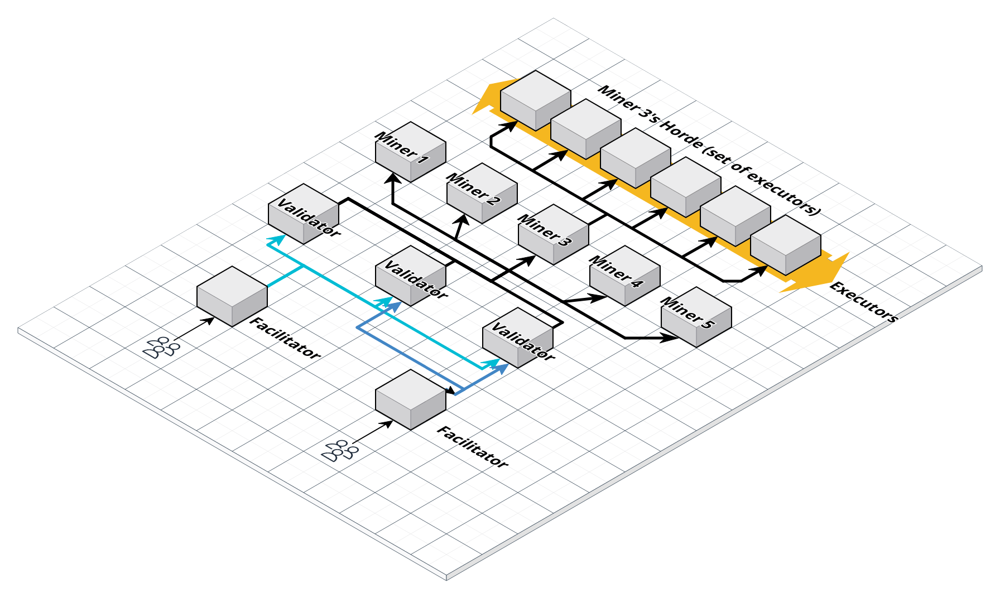

# What is this

This repository contains reference implementations of

1. Validator
2. Miner
3. Executor

of the ComputeHorde BitTensor SubNet. Running etc. is explained in each component's README.

# ComputeHorde



Data flow looks like this:

1. **Facilitator** is an internet facing app charging users for accepting jobs from them, which are then passed on to validators.
1. **Validator** has the same meaning as in other Bittensor subnets. It receives organic requests (requests from end users) or generates synthetic ones itself, sends them to miners and reads the results. Results for organic traffic are then passed back to end users, while synthetic traffic is used to adjust miners' scores.
[See validator's README for more details](validator/README.md)
1. **Miner** has the same meaning as in other Bittensor subnets. It receives job requests from validators, spawns executors to do the actual work and sends the results back to validators.
[See miner's README for more details](miner/README.md)
1. **Executor** is a virtual machine managed by a single miner, spawned to perform a single dockerized job, and is scrapped afterwards. Its access to the network is limited to necessary bits needed to execute a job, i.e. communicate with a miner, download the docker image that runs the job, download the docker image containing executor app, and mount the job data volume. Executors have hardware classes assigned and together form the horde of a miner.
[See executor's README for more details](executor/README.md)

# Scoring

Currently miners are rewarded for providing the time of networkless GPU-equipped servers, proportionally to their efficiency. Each miner can (for now) provide only their fastest Executor.

In February 2024 this will change - subnet will define more resource types andValidators will reward miners more for providing resources that are in higher demand. The system will quickly fill to capacity with organic traffic.

# Incoming changes
* Introduce hardware classes to create a free market that delivers the most cost-effective hardware, rather than solely focusing on the strongest hardware.
* Organic jobs should not be free to allow the free market to regulate demand on hardware classes effectively.
* Support long-running jobs by accounting for miners' work in 10-minute intervals, ensuring they can be paid for unfinished long-running jobs.
* Implement rules and safeguards to prevent malicious actors from exploiting the network, ensuring a fair and secure environment for all participants.
* Develop a resource-sharing system that allocates resources proportionally to each user's stake. However, also allow low-stake users to utilize network resources freely when there is no competing demand from other users.
* Implement a mechanism for miner servers to reject jobs for a given hardware class if accepting the job would result in a financial loss for the miner.
* Ensure that benchmark jobs are paid in the same manner as organic jobs: job duration multiplied by the hardware class multiplier and the benchmark value.
* When a new miner is registered, require all validators to benchmark the miner's hardware classes with extended timeouts to accurately assess their capabilities.
* When a new validator registers, they must benchmark every other miner in the network to maintain an up-to-date and comprehensive understanding of available resources. Until a miner is benchmarked by the validator, the validator defaults to 1 as the locally_measured_efficiency_factor for that miner.
* Miners will have the ability to modify their hardware class availability manifest at a frequency of once every 2 hours. In the event that a miner has available executors, they are obligated to accept assigned jobs and cannot reject them. Should a miner reject a job under such circumstances, the validator will impose a penalty by lowering the hardware class local multiplier for all tasks associated with that miner.


```python
points = {}
for miner in miners:
    for hardware_class in miner.executors:
        executor = miner.executors[hardware_class]
        hardware_class_relative_value = hardware_classes[hardware_class].relative_value
        points[miner.hotkey] = (
            hardware_class_relative_value
            * executor.locally_measured_efficiency_factor
            * executor.total_worked_seconds
        )
```

# Running

## Validator

To run a validator, first you need to [setup a trusted miner for cross-validation](/validator/README.md#setting-up-a-trusted-miner-for-cross-validation) and [provision S3 buckets for prompts and answers](/validator/README.md#provision-s3-buckets-for-prompts-and-answers) of LLM jobs.

**If you are upgrading** your validator to support LLM jobs, prepare a trusted miner and S3 buckets (find out how using the links above). Then, set the environment variables directly in the .env file of your validator instance and restart your validator:

```
$ docker compose down --remove-orphans && docker compose up -d
```

Set the following environment variables in a terminal on your local machine (on the machine where you have your wallet files):

```sh
export TRUSTED_MINER_ADDRESS=...
export TRUSTED_MINER_PORT=...

export S3_BUCKET_NAME_PROMPTS=...
export S3_BUCKET_NAME_ANSWERS=...

export AWS_ACCESS_KEY_ID=...
export AWS_SECRET_ACCESS_KEY=...
export AWS_ENDPOINT_URL=...
```

Note: setting `AWS_ENDPOINT_URL` is optional. If not given, the default AWS S3 endpoint will be used.

Then execute the following command from the same terminal session:

```shell
curl -sSfL https://github.com/backend-developers-ltd/ComputeHorde/raw/master/install_validator.sh | bash -s - SSH_DESTINATION HOTKEY_PATH
```

Replace `SSH_DESTINATION` with your server's connection info (i.e. `username@1.2.3.4`)
and `HOTKEY_PATH` with the path of your hotkey (i.e. `~/.bittensor/wallets/my-wallet/hotkeys/my-hotkey`).
This script installs necessary tools in the server, copies the keys and starts the validator with the corresponding runner and default config.

If you want to change the default config, see [Validator runner README](validator/envs/runner/README.md) for details.

If you want to trigger jobs from the validator see [Validator README](validator/docs/validator.md) for details.

## Miner

To quickly start a miner, create an Ubuntu Server and execute the following command from your local machine (where you have your wallet files).

```shell
curl -sSfL https://github.com/backend-developers-ltd/ComputeHorde/raw/master/install_miner.sh | bash -s - production SSH_DESTINATION HOTKEY_PATH
```

Replace `SSH_DESTINATION` with your server's connection info (i.e. `username@1.2.3.4`)
and `HOTKEY_PATH` with the path of your hotkey (i.e. `~/.bittensor/wallets/my-wallet/hotkeys/my-hotkey`).
This script installs necessary tools in the server, copies the keys and starts the miner with the corresponding runner and default config.

If you want to change the default config, see [Miner runner README](miner/envs/runner/README.md) for details.


## Checking that your miner works properly

1. Check if your miner is reachable from a machine different from the miner: `curl {ADDRESS}:{PORT}/admin/login/ -i`.
   Both `PORT` and `ADDRESS` can be obtained from the metagraph. If everything is ok the first line should read
   `HTTP/1.1 200 OK`. By default, the address is automatically determined by bittensor lib, but you can input 
   your own in .env
2. Check if you're getting any jobs and what the outcomes are. An admin panel for that is coming but for now you
   achieve that with `docker-compose exec miner-runner docker-compose exec db psql postgres -U postgres -c 'select *
   from miner_acceptedjob order by id desc;`

# Migrating servers

If you need to move your miner or validator to a new server,
see the [migration guide](/docs/migration.md).
