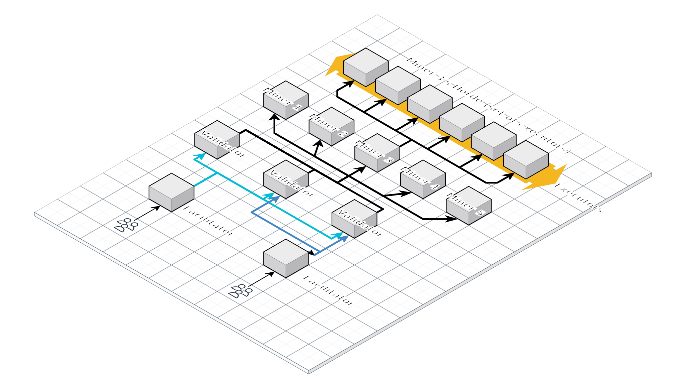

# ComputeHorde (Subnet 12 of Bittensor)



ComputeHorde is a specialized subnet within the [Bittensor network](https://bittensor.com) 
designed to **supercharge Bittensor with scalable and trusted GPU computing power**. 

By transforming untrusted GPUs provided by miners into trusted compute resources, 
ComputeHorde enables **validators of other subnets** to access large amounts of decentralized computing power cost-effectively, 
paving the way for Bittensor to scale beyond its current limitations to support potentially over 1,000 subnets.

## Key Features

- **Decentralized Compute for Bittensor Validators**  
  ComputeHorde aims to become the go-to decentralized source for hardware needed to validate other subnets.
  The mission is to decrease the Bittensor ecosystem's dependency on centralized services.
  The assurance of the miners' work quality is essential for the Bittensor's overall reliability.
  
- **Fair and Verified Work**  
  ComputeHorde employs mechanisms to ensure miners provide authentic compute work, fairly verified by the validators:
  - Execute tasks from validators stake-proportionally
  - Handle both **organic** (external, from other subnets) and **synthetic** (ComputeHorde miners validation) tasks.
  - Match jobs to the advertised hardware (e.g., ensuring A6000 GPUs are used for tasks requiring them).
  - Prevent malicious behaviors like "weight-copying" through innovative validation mechanisms.

- **Scalable Mining with Executors**  
  Each miner in ComputeHorde can spawn multiple **executors**, performing individual compute tasks. 
  This removes the 256 miner (UID) limit and significantly scales the potentially available computing power.

- **Hardware Classes**  
  ComputeHorde introduces hardware classes to create a free market for GPU resources, balancing cost-effectiveness with performance. 
  Currently, **A6000** is the supported class, with **A100** coming next.
  The end goal is to eventually support all GPU types/configurations required by validators across Bittensor subnets.

## Bittensor Context

Bittensor is a decentralized network designed to ensure that AI, the most critical technology of our era, remains accessible to everyone and free from the control of centralized entities.
Each Bittensor subnet specializes in a _digital commodity_, ranging from storage and large language models to general computing. 

This is achieved by distributing $TAO tokens to incentivize:
- Subnet owners to define the most useful and reliable commodities (by designing the incentive mechanism),
- Miners to deliver high-quality and efficient services innovatively,
- Validators to reward miners based on their performance.

Bittensor's end goal is to create an unstoppable, self-sustaining ecosystem free from single-point control, enabling innovation and resilience for the entire network.
ComputeHorde adds GPU-powered validation to this ecosystem, helping other subnets operate effectively without relying on centralized cloud services.

## Scoring Mechanism

The scoring mechanism in ComputeHorde is designed to **incentivize miners to perform organic jobs** while 
maintaining accountability and fairness in the network. 

Miners are scored based on their **performance during peak cycles**,
encouraging them to **scale up executors when demand is high** while **minimizing active resources during non-peak periods** to reduce costs.

The core mechanism ensures that miners can **reject synthetic jobs without penalty if they provide proof that they are actively engaged in an organic job**.

### Peak and Non-Peak Cycles

ComputeHorde operates in **10-cycle testing days** (each cycle is **2 Bittensor tempos**, i.e., **720 blocks**).
Within each testing day, **one cycle is designated as the peak cycle**.

- **Scoring is performed primarily during peak cycles.**
  - Miners should **declare their full executor capacity** during peak cycles to maximize their score.

- During **non-peak cycles**, miners should:
  - **Maintain at least 10% of their peak executors** to avoid a **20% penalty on their score**.
     - Miners who declare **more than 10% of their peak executors** will not receive additional synthetic jobs, meaning excess executors will remain idle, leading to unnecessary costs.
  - **Remain available for organic jobs**, which provide points **regardless of peak or non-peak status**.

### Formula (calculated per validator, in peak cycles)

- **1 point** for each successfully completed **synthetic job**.
- **1 point** for each successfully completed **organic job** (**awarded in all cycles**).
- **1 point** for each **properly rejected synthetic job** (when a miner provides a receipt proving they are occupied with an organic job from another validator with at least μ30k stake).
- A **successfully completed job** is one that finishes within a specified timeout.

### Dancing Bonus (validated in peak cycles only)

Miners who implement **dancing**—moving their executors between different UIDs—receive a **30% bonus** to their scores.

- **Dancing is verified only during peak cycles.**
- If a miner **changes UIDs between two consecutive peak cycles (Peak-1 → Peak-2)**, they receive the **dancing bonus** in **Peak-2 and all non-peak cycles leading up to Peak-3**.
- If a miner missed Peak-1 but performed dancing before Peak-2, the bonus is still awarded for Peak-2 and the following non-peak cycles.

This encourages **variance**, which is essential for preventing [weight-copying](#discouraging-weight-copying).

### Hardware Classes and Configurable Weights

- Each **hardware class** in ComputeHorde has a **configurable weight**.  
- These weights influence the miner’s final score, prioritizing certain hardware types based on network demand.


## Components

### **Facilitator**
- Acts as a gateway for organic requests (from other subnets’ validators) to enter ComputeHorde.
- Sends tasks to chosen validators, who then distribute them to miners.

### **Validator**
- Receives organic requests via the Facilitator or generates synthetic tasks for validation.
- Distributes both kinds of tasks to miners and evaluates the results:
- Uses a separate GPU, called a **Trusted Miner**, to pre-run part of the validation tasks and establish expected results. 
  The Trusted Miner shares the same code as a regular miner, but is configured differently:
  - It is not registered in the metagraph.
  - It only accepts tasks from the associated validator.
- [See validator's README for more details](validator/README.md)

### **Miner**
- Accepts job requests from validators.
- Manages executors to perform tasks and sends results back to validators.
- [See miner's README for more details](miner/README.md)

### **Executor**
- An instance spawned by a miner to perform a single dockerized task.
- Operates in a restricted environment, with limited network access necessary for:
  - communicating with miners,
  - downloading docker images,
  - handling job data.
- Executors form a **horde** of a miner and are assigned hardware classes.
- [See executor's README for more details](executor/README.md)

## Innovations to Highlight

### Discouraging Weight-Copying
- Commit-Reveal: Validators post hidden weights and reveal them in the next epoch, making the copying of _current_ weights impossible.
- Executor Dancing: Miners randomly move GPUs across multiple UIDs, further reducing the effectiveness of copying old weights.

### Encouraging Actual Mining
- Synthetic tasks are designed to run only on specific hardware (e.g., A6000 GPUs), ensuring miners deliver the advertised compute power.
- Scoring system incentivizing for completing organic tasks.

## Development goals

1. **Bring organic jobs from other subnets' validators**  
   Allow the free market to regulate demand and prioritize cost-effective hardware, rather than solely focusing on the strongest hardware.

1. **Strengthen Security**  
   Introduce rules and safeguards to prevent malicious actors from exploiting the network, ensuring a fair and secure environment for all participants.

1. **Support Long-Running Jobs**  
   Implement accounting mechanisms for miners to be rewarded proportionally to the time spent, even for incomplete long-running tasks.

1. **Expand Hardware Support**  
   Add support for all GPU classes required by other Bittensor subnets.

1. **Fair Resource Sharing**  
   Allocate resources based on validators' stakes while allowing low-stake validators access when demand is low.

## Info pack

- ComputeHorde mainnet netuid: 12
- ComputeHorde testnet netuid: 174
- [ComputeHorde channel](https://discordapp.com/channels/799672011265015819/1201941624243109888) within Bittensor discord
- Information dashboards:
  - [Subnet 12 health monitor](https://grafana.bactensor.io/d/subnet/metagraph-subnet?var-subnet=12)
  - [Subnet 12 TaoStats](https://taostats.io/subnets/12) 
  - [Subnet 12 TaoMarketCap](https://taomarketcap.com/subnets/12)

# Running ComputeHorde components

This repository contains the implementations of:

- **Validator**: Requires a [Trusted Miner](#validator) for cross-checking synthetic tasks.
- **Miner**: Modifying the miner code on subnet 12 is discouraged, as the stock implementation manages only communications between components.
  The competitive edge lies in optimizing executor provisioning.
  Users can create [custom executor managers](miner#custom-executor-manager) to scale and optimize mining efficiency.
  The default executor manager runs a single executor and is not intended for mainnet use.

In the following sections, you can find instructions on running [Validator](#Validator) and [Miner](#Miner).
There are more details in each component's README and in the [Troubleshooting](#Troubleshooting) section below.

Modifications to ComputeHorde components are generally not recommended, with the exception of the [ExecutorManager class](miner#custom-executor-manager). 
Customizing this class allows you to implement dedicated logic for handling executors, such as running multiple executors per miner.

## Validator

ComputeHorde validator is built out of three components
1. trusted miner (requires A6000 - the only GPU supported now) for cross-validation
1. two S3 buckets for sharing LLM data (lots of small text files)
1. validator machine (standard, non-GPU) - for regular validating & weight-setting

The steps, performed by running installation scripts **on your local machine**, which has your wallet files. For clarity, **these installation scripts are not run on the machine that will become the trusted miner or the validator**, the scripts will connect through SSH to those machines from your local machine:
1. [setup trusted miner](/validator#setting-up-a-trusted-miner-for-cross-validation) 
1. [provision S3 buckets for prompts and answers](/validator#provision-s3-buckets-for-prompts-and-answers) 
1. [setup validator](#validator-setup)

### Validator setup

#### Upgrading already existing deployment

Prepare a trusted miner and S3 buckets (find out how using the links above). 
Then, set the [environment variables](#deploying-from-scratch) directly in the `.env` file of your **validator** instance and restart your validator:

```
$ docker compose down --remove-orphans && docker compose up -d
```

#### Deploying from scratch

Set the following environment variables in a terminal on your **local machine** (on the machine where you have your wallet files):

```sh
export TRUSTED_MINER_ADDRESS=...
export TRUSTED_MINER_PORT=...

export S3_BUCKET_NAME_PROMPTS=...
export S3_BUCKET_NAME_ANSWERS=...

export AWS_ACCESS_KEY_ID=...
export AWS_SECRET_ACCESS_KEY=...
export AWS_DEFAULT_REGION=...
```

Note: The `AWS_DEFAULT_REGION` property is optional. Use it when your buckets are not in your default AWS region.

Export `AWS_ENDPOINT_URL` to use another cloud object storage (s3-compatible) provider. If not given, AWS S3 will be used.

Some cloud configuration may require you to specify a signature version (used for presigning links). You can do
that by adding `AWS_SIGNATURE_VERSION=...` to your validator's `.env`.

Then execute the following command from the same terminal session:

```shell
curl -sSfL https://github.com/backend-developers-ltd/ComputeHorde/raw/master/install_validator.sh | bash -s - SSH_DESTINATION HOTKEY_PATH
```

Replace:
- `SSH_DESTINATION` with your server's connection info (i.e. `username@1.2.3.4`)
- `HOTKEY_PATH` with the path of your hotkey (i.e. `~/.bittensor/wallets/my-wallet/hotkeys/my-hotkey`)

This script installs the necessary tools in the server, copies the public keys,  and starts the validator with the corresponding runner and the default config.

If you want to change the default config, see [Validator runner README](validator/envs/runner/README.md) for details.

If you want to trigger jobs from the validator see [Validator README](validator/docs/validator.md) for details.

If anything seems wrong, check the [troubleshooting](#troubleshooting) section.

## Miner

To quickly start a miner, create an Ubuntu Server and execute the following command from your local machine (where you have your wallet files).

```shell
curl -sSfL https://github.com/backend-developers-ltd/ComputeHorde/raw/master/install_miner.sh | bash -s - production SSH_DESTINATION HOTKEY_PATH
```

Replace `SSH_DESTINATION` with your server's connection info (i.e. `username@1.2.3.4`)
and `HOTKEY_PATH` with the path of your hotkey (i.e. `~/.bittensor/wallets/my-wallet/hotkeys/my-hotkey`).
This script installs necessary tools in the server, copies the keys, and starts the miner with the corresponding runner and default config.

If you want to change the default config, see [Miner runner README](miner/envs/runner/README.md) for details.


## Checking that your miner works properly

1. Check if your miner is reachable from a machine different from the miner: `curl {ADDRESS}:{PORT}/admin/login/ -i`.
   Both `PORT` and `ADDRESS` can be obtained from the metagraph. If everything is ok the first line should read
   `HTTP/1.1 200 OK`. By default, the address is automatically determined by bittensor lib, but you can input 
   your own in .env
2. Check if you're getting any jobs and what the outcomes are. An admin panel for that is coming but for now you
   achieve that with `docker-compose exec miner-runner docker-compose exec db psql postgres -U postgres -c 'select *
   from miner_acceptedjob order by id desc;`

# Migrating servers

If you need to move your miner or validator to a new server,
see the [migration guide](/docs/migration.md).

# Troubleshooting

## How to dump the logs

The ComputeHorde software starts several Docker containers, 
with layout differing slightly between the miner and the validator.

### Miner logs

The most relevant logs are from the container with a name ending in `app-1`.

1. SSH into the miner machine.
1. Run `docker ps` to find the name of the appropriate container (e.g., `compute_horde_miner-app-1`).
1. Run `docker logs CONTAINER_NAME`.

### Validator logs

1. SSH into the validator machine.
1. Navigate to the directory where the docker compose yaml file is located.
1. Run `docker compose logs`.

## How to restart the services

To perform a hard restart of all ComputeHorde Docker containers, run the following commands:

```bash
docker compose down --remove-orphans
docker compose up -d
```

Afterwards, use `docker ps` to verify that the containers have started successfully.

## How to delete persistent volumes

To start fresh and remove all persistent data, follow these steps:

1. Stop the validator or miner (all running containers)
1. Run `docker volume ls` to list all existing volumes and identify the ones to delete.
   Key volumes to consider:
    - Miner: `miner_db_data`, `miner_redis_data`
    - Validator: `validator_db`, `validator_redis`, `validator_static`
1. Run the following command to remove all Docker volumes:
   ```bash
   docker volume rm $(docker volume ls -q)
   ```
1. Start the validator or miner again

## How to fix issues with installing `cuda-drivers`

Miner installation may occasionally fail with an error about the system being unable to install the `cuda-drivers` package. 
This issue is often caused by mismatched drivers already installed before running the installation script.

To resolve this:
1. Run the following command on the miner machine to purge any conflicting NVIDIA packages:
   ```bash
   sudo apt-get purge -y '^nvidia-.*'
   ```
1. Re-run the `install_miner.sh` script from your local machine.

## How to check if NVIDIA Drivers are working and the GPU is usable

To verify the health of the NVIDIA setup, run the following command on the miner machine:
```bash
docker run --rm --runtime=nvidia --gpus all ubuntu nvidia-smi
```

If the output indicates a problem (especially immediately after installation), a [restart of the services](#how-to-restart-the-services) may help.

## How to list the contents of S3 buckets

To verify that the S3 buckets are configured correctly, 
you can list their contents by running the following command on a machine with the AWS CLI installed 
(check out the [Amazon instructions](https://docs.aws.amazon.com/cli/latest/userguide/getting-started-install.html)). 
Replace the placeholders with the appropriate values:

```
AWS_ACCESS_KEY_ID=... AWS_SECRET_ACCESS_KEY=... aws s3api list-objects --bucket BUCKET_NAME
```

The bucket names and required AWS credentials are stored in the validator’s `.env` file as:
- `S3_BUCKET_NAME_PROMPTS`
- `S3_BUCKET_NAME_ANSWERS`
- `AWS_ACCESS_KEY_ID`
- `AWS_SECRET_ACCESS_KEY`

If you encounter a permissions error, such as missing the `s3:ListBucket` permission, you may need to use the AWS root user credentials.
