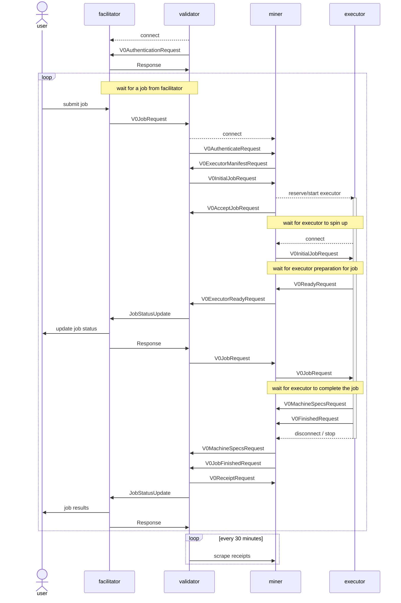

# Sequence Diagram of Organic Jobs (with loops)

```mermaid
sequenceDiagram
    actor user
    participant facilitator
    participant validator
    participant miner
    participant executor

    validator-->>facilitator: connect
    validator->>facilitator: V0AuthenticationRequest
    facilitator->>validator: Response
    
    loop
        Note over facilitator,validator: wait for a job from facilitator
        user->>facilitator: submit job
        facilitator->>validator: V0JobRequest
    
        validator-->>miner: connect
        validator->>miner: V0AuthenticateRequest
        miner->>validator: V0ExecutorManifestRequest
    
        validator->>miner: V0InitialJobRequest
        miner-->>executor: reserve/start executor
        activate executor
        miner->>validator: V0AcceptJobRequest
        
        Note over miner,executor: wait for executor to spin up
        executor-->>miner: connect
        miner->>executor: V0InitialJobRequest
        Note over miner,executor: wait for executor preparation for job
        executor->>miner: V0ReadyRequest
        miner->>validator: V0ExecutorReadyRequest
        validator->>facilitator: JobStatusUpdate
        facilitator->>user: update job status
        facilitator->>validator: Response
    
        validator->>miner: V0JobRequest
        miner->>executor: V0JobRequest
    
        Note over miner,executor: wait for executor to complete the job
        executor->>miner: V0MachineSpecsRequest
        executor->>miner: V0FinishedRequest
    
        executor-->>miner: disconnect / stop
        deactivate executor
    
        miner->>validator: V0MachineSpecsRequest
        miner->>validator: V0JobFinishedRequest
        validator->>miner: V0ReceiptRequest
    
        validator->>facilitator: JobStatusUpdate
        facilitator->>user: job results
        facilitator->>validator: Response
    end
    
    loop every 30 minutes
        validator->>miner: scrape receipts
    end
    
```
