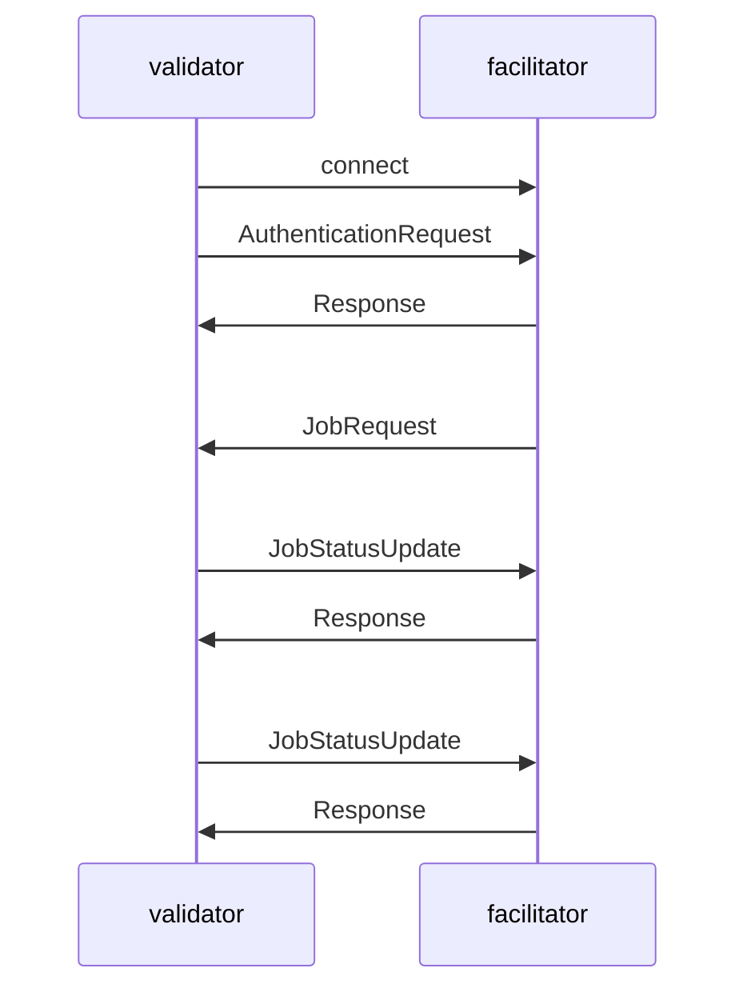

# Facilitator Protocol

A Facilitator need to have one websocket endpoint `/ws/v0/` that validators connect to.
The communication consists of the following steps:

1. Validator connects to facilitator via websockets at `/ws/v0/`
2. Validator sends `AuthenticationRequest` message (and wait for `Response`). This is done once per connection.
3. Validator and facilitator enters in a job loop
    1. Validator waits for a job
    2. Facilitator sends `JobRequest` message
    3. Validator sends `JobStatusUpdate` message when there is new info about the job and wait for `Response` from
       facilitator (i.e., after sending the job to a miner, after a miner accepts the job, after the job has
       finished/failed)

Sequence diagram:



## `AuthenticationRequest` message

```json
{
  "message_type": "V0AuthenticationRequest",
  "public_key": "...",
  "signature": "..."
}
```

| Field        | Details                                                                                               |
|--------------|-------------------------------------------------------------------------------------------------------|
| `public_key` | the hex of the public key of validator hotkey                                                         |
| `signature`  | the hex of the signature of the validator hotkey's public key with the private key prefixed with `0x` |

## `JobRequest` message

```json
{
  "message_type": "V0JobRequest",
  "uuid": "...",
  "miner_hotkey": "...",
  "docker_image": "...",
  "raw_script": "...",
  "args": [
    "..."
  ],
  "env": {
    "...": "..."
  },
  "use_gpu": true,
  "input_url": "...",
  "output_url": "..."
}
```

| Field        | Details                                                                                              |
|--------------|------------------------------------------------------------------------------------------------------|
| uuid         | unique ID for a job (UUIDv4)                                                                         |
| miner_hotkey | SS58 address of miner that will perform the job                                                      |
| docker_image | user provided docker image                                                                           |
| raw_script   | user provided raw python script                                                                      |
| args         | list of arguments for the docker image or raw script                                                 |
| env          | key-value pairs of environment variables                                                             |
| use_gpu      | whether GPU is needed to run the job                                                                 |
| input_url    | URL to a zip file to be mounted in the job environment                                               |
| output_url   | URL to upload output volume to, miner will do a PUT request with a zip file containing output volume |

## `JobStatusUpdate` message

```json
{
  "message_type": "V0JobStatusUpdate",
  "uuid": "...",
  "status": "...",
  "metadata": {
    "comment": "",
    "miner_response": {
      "job_uuid": "...",
      "message_type": "...",
      "docker_process_stderr": "...",
      "docker_process_stdout": "..."
    }
  }
}
```

| Field                   | Details                                               |
|-------------------------|-------------------------------------------------------|
| uuid                    | the unique job uuid this status is for                |
| status                  | `failed`, `rejected`, `accepted` or, `completed`      |
| metadata                | (optional) the metadata for this status               |
| metadata.comment        | summery of the metadata                               |
| metadata.miner_response | (optional) the response of miner when a job completes |

## `Response` message

```json
{
  "status": "error",
  "errors": [
    {
      "msg": "...",
      "type": "...",
      "help": "..."
    }
  ]
}
```

| Field         | Details                          |
|---------------|----------------------------------|
| status        | `success` or `error`             |
| errors[].msg  | description of error             |
| errors[].type | type of error                    |
| errors[].help | optional help text for the error |
