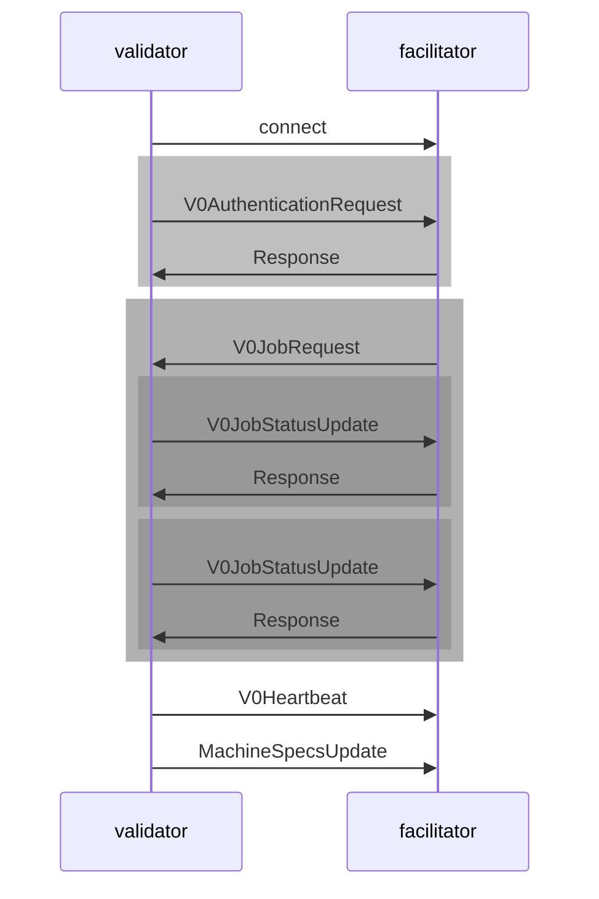

# Facilitator Protocol v0

A Facilitator need to have a websocket endpoint `/ws/v0/` that validators connect to.
The communication consists of the following steps:

1. Validator connects to facilitator via websockets at `/ws/v0/`.
2. Validator sends `V0AuthenticationRequest` message (and wait for `Response`). This is done once per connection.
3. Validator and facilitator enters in a job loop:
    1. Validator waits for a job
    2. Facilitator sends `V0JobRequest` message
    3. Validator sends `V0JobStatusUpdate` message when there is new info about the job and wait for `Response` from
       facilitator (i.e., after sending the job to a miner, after a miner accepts the job, after the job has
       finished/failed)
4. Validator sends a `V0Heartbeat` message periodically (i.e. every 60 seconds) as long as the connection is open.
5. Validator will sometimes send `V0MachineSpecsUpdate` messages.

Sequence diagram:



## `V0AuthenticationRequest` message

```json
{
  "message_type": "V0AuthenticationRequest",
  "public_key": "...",
  "signature": "..."
}
```

| Field        | Details                                                                                               |
|--------------|-------------------------------------------------------------------------------------------------------|
| `public_key` | the hex of the public key of validator hotkey                                                         |
| `signature`  | the hex of the signature of the validator hotkey's public key with the private key prefixed with `0x` |

You can generate the public key and signature with the following snippet of code:

```python
import bittensor

hotkey = bittensor.wallet(name="wallet-name", hotkey="hotkey-name", path="wallets-path").get_hotkey()
public_key = hotkey.public_key.hex()
signature = f'0x{hotkey.sign(hotkey.public_key).hex()}'
```

The signature can be verified with the following snippet:

```python
from bittensor import Keypair

public_key_bytes = bytes.fromhex(public_key)
keypair = Keypair(public_key=public_key_bytes, ss58_format=42)
keypair.verify(public_key_bytes, signature)
```

## `V0JobRequest` message

```json
{
  "message_type": "V0JobRequest",
  "uuid": "...",
  "miner_hotkey": "...",
  "docker_image": "...",
  "raw_script": "...",
  "args": [
    "..."
  ],
  "env": {
    "...": "..."
  },
  "use_gpu": true,
  "input_url": "...",
  "output_url": "..."
}
```

| Field        | Details                                                                                                                                                                                                                                                 |
|--------------|---------------------------------------------------------------------------------------------------------------------------------------------------------------------------------------------------------------------------------------------------------|
| uuid         | unique ID for a job (UUIDv4)                                                                                                                                                                                                                            |
| miner_hotkey | SS58 address of miner that will perform the job                                                                                                                                                                                                         |
| docker_image | user provided docker image                                                                                                                                                                                                                              |
| raw_script   | user provided raw python script                                                                                                                                                                                                                         |
| args         | list of arguments for the docker image or raw script                                                                                                                                                                                                    |
| env          | key-value pairs of environment variables                                                                                                                                                                                                                |
| use_gpu      | whether GPU is needed to run the job                                                                                                                                                                                                                    |
| input_url    | URL to a zip file to be mounted in the job environment. It is downloaded before the job is started and mounted at `/volume/` of the job container. Note that, the URL must return a proper `Content-Length` header, otherwise it will fail to download. |
| output_url   | URL to upload output volume to, miner will do a PUT request with a zip file containing output volume                                                                                                                                                    |

## `V0JobStatusUpdate` message

```json
{
  "message_type": "V0JobStatusUpdate",
  "uuid": "...",
  "status": "...",
  "metadata": {
    "comment": "",
    "miner_response": {
      "job_uuid": "...",
      "message_type": "...",
      "docker_process_stderr": "...",
      "docker_process_stdout": "..."
    }
  }
}
```

| Field                   | Details                                               |
|-------------------------|-------------------------------------------------------|
| uuid                    | the unique job uuid this status is for                |
| status                  | `failed`, `rejected`, `accepted` or, `completed`      |
| metadata                | (optional) the metadata for this status               |
| metadata.comment        | summary of the metadata                               |
| metadata.miner_response | (optional) the response of miner when a job completes |

`metadata.miner_response`:

| Field                 | Details                                                                 |
|-----------------------|-------------------------------------------------------------------------|
| job_uuid              | the unique job uuid this status is for                                  |
| message_type          | `V0JobFailedRequest` if job failed, `V0JobFinishedRequest` if succeeded |
| docker_process_stderr | standard out of job process (*)                                         |
| docker_process_stdout | standard error of job process (*)                                       |

* The standard out and standard error texts are truncated if they are large.
  The full output is saved in the output zip file at `/stdout.txt` and `/stderr.txt` respectively.

## `V0Heartbeat` message

```json
{
  "message_type": "V0Heartbeat"
}
```

## `Response` message

```json
{
  "status": "success",
  "errors": []
}
```

or,

```json
{
  "status": "error",
  "errors": [
    {
      "msg": "...",
      "type": "...",
      "help": "..."
    }
  ]
}
```

| Field         | Details                          |
|---------------|----------------------------------|
| status        | `success` or `error`             |
| errors[].msg  | description of error             |
| errors[].type | type of error                    |
| errors[].help | optional help text for the error |

## `V0MachineSpecsUpdate` message

```json
{
  "message_type": "V0MachineSpecsUpdate",
  "miner_hotkey": "...",
  "validator_hotkey": "...",
  "specs": {}
}
```

| Field            | Details                                    |
|------------------|--------------------------------------------|
| miner_hotkey     | The hotkey of miner whose specs was sent   |
| validator_hotkey | The hotkey of validator who sent the specs |
| specs            | Raw specs of the miner hardware            |

`specs` field have roughly the following format:

```json
{
  "os": "Ubuntu Noble Numbat (development branch)",
  "cpu": {
    "count": "8",
    "model": "Intel(R) Xeon(R) Gold 5315Y CPU @ 3.20GHz",
    "clocks": [3202.303, 3202.303, 3202.303, 3202.303, 3202.303, 3202.303, 3202.303, 3202.303]
  },
  "gpu": {
    "count": 1,
    "details": [
      {
        "cuda": "8.6",
        "name": "NVIDIA RTX A6000",
        "driver": "550.54.15",
        "capacity": "49140",
        "power_limit": "300.00",
        "memory_speed": "405",
        "graphics_speed": "0"
      }
    ]
  },
  "ram": {
    "free": "22817068",
    "used": "",
    "total": "46236340",
    "available": "43255832"
  },
  "hard_disk": {
    "free": "210912280",
    "used": "",
    "total": ""
  },
  "virtualization": "xen\nxen-hvm\ndocker"
}
```
